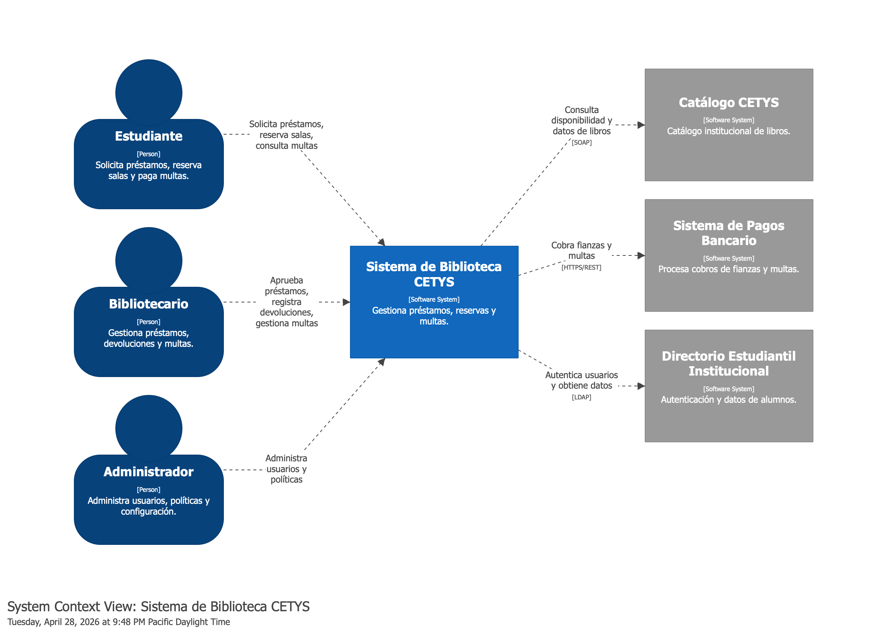

# Pregunta 1A — Diagrama de Contexto (10 pts)

## Enunciado

Dibuja el **diagrama de contexto del sistema** (C4 nivel 1). Incluye:

- El sistema en el centro con nombre y descripción de una línea
- Todos los actores humanos con sus roles
- Los tres sistemas externos. Indica la dirección y el propósito de cada relación
- Usa notación C4 clara: rectángulos etiquetados con nombre, tipo y descripción breve

**Nota:** En este nivel no aparecen tecnologías ni componentes internos. La audiencia objetivo es no técnica.

## Solución

### Cómo renderizar el diagrama

1. Abre [https://structurizr.com/dsl](https://structurizr.com/dsl)
2. Pega el contenido de [`workspace.dsl`](./workspace.dsl)
3. Selecciona la vista **"Contexto"**
4. Exporta como PNG y reemplaza el archivo en `../diagramas/png/1A-contexto.png`

### Diagrama

### Decisiones de modelado

**El "Sistema bancario" del enunciado se modela como sistema externo, no como actor humano.** Aunque la tabla del enunciado lista al "Sistema bancario" en la columna de actores junto con Estudiante, Bibliotecario y Admin, en C4 nivel 1 la distinción entre actor humano (`person`) y sistema software (`softwareSystem`) es semántica. Un sistema bancario es software, no persona.

Por tanto:

- **Actores humanos:** Estudiante, Bibliotecario, Administrador
- **Sistemas externos:** Catálogo CETYS, Sistema de Pagos Bancario, Directorio Estudiantil Institucional
- **Sistema central:** Sistema de Biblioteca CETYS

### Dirección y propósito de cada relación

| Origen | Destino | Propósito | Protocolo (info, no se muestra en nivel 1) |
|--------|---------|-----------|---------------------------------------------|
| Estudiante | Sistema | Solicitar préstamos, reservar salas, consultar multas | HTTPS |
| Bibliotecario | Sistema | Aprobar préstamos, registrar devoluciones, gestionar multas | HTTPS |
| Administrador | Sistema | Administrar usuarios y políticas | HTTPS |
| Sistema | Catálogo CETYS | Consultar disponibilidad y datos de libros | SOAP |
| Sistema | Sistema de Pagos Bancario | Cobrar fianzas y multas | REST |
| Sistema | Directorio Institucional | Autenticar usuarios y obtener datos de alumnos | LDAP |

Las flechas salen del Sistema de Biblioteca hacia los sistemas externos porque es el sistema central quien **inicia** las consultas. Los sistemas externos solo responden.

### Justificación de la audiencia no técnica

En este nivel **no se incluyen** tecnologías como React, Spring Boot ni PostgreSQL. Solo aparecen los nombres de los sistemas y la finalidad de cada interacción. Esto permite que el rector, los bibliotecarios o cualquier stakeholder no técnico entienda el alcance del sistema en una sola vista.
