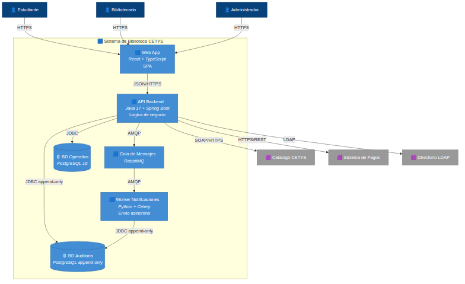

# Pregunta 1B — Diagrama de Contenedores (12 pts)

## Enunciado

Expande al **nivel 2 (Containers)**. Descompón el sistema en al menos 4 contenedores (por ejemplo: Web App, API Backend, Base de Datos, Worker de Notificaciones). Para cada contenedor especifica:

- Tecnología propuesta y justificación breve
- Responsabilidad principal
- Qué sistemas externos o actores se conectan a él y con qué protocolo

## Solución

### Cómo renderizar el diagrama

El [`workspace.dsl`](./workspace.dsl) contiene la vista **"Contenedores"** en el mismo workspace. Al renderizarlo en Structurizr, selecciona esa vista.

### Diagrama exportado

### Tabla justificativa

Se proponen **6 contenedores** (más de los 4 mínimos para cumplir requisitos no funcionales):

| Contenedor | Tecnología y justificación | Responsabilidad principal | Conexiones |
|---|---|---|---|
| **Web App** | React + TypeScript. SPA moderna, ecosistema maduro y tipado fuerte que reduce errores en formularios complejos (préstamos, reservas). | Renderizar la UI y consumir la API. No contiene lógica de negocio. | Estudiante, Bibliotecario, Admin (HTTPS) → API (JSON/HTTPS). |
| **API Backend** | Java 17 + Spring Boot. Stack consistente con el curso de OOP; Spring facilita la inyección de dependencias necesaria para Clean Architecture. | Orquestar préstamos, reservas, multas, autenticación, auditoría e integración con sistemas externos. | Web App, BD Operativa, BD Auditoría, Cola, Catálogo (SOAP), Pagos (REST), Directorio (LDAP). |
| **Worker de Notificaciones** | Python + Celery. Excelente para tareas asíncronas y envío de correos masivos sin bloquear la API. | Procesar mensajes de la cola y enviar notificaciones (recordatorios de devolución, multas). | Cola (AMQP), BD Auditoría. |
| **Cola de Mensajes** | RabbitMQ. Estándar para mensajería empresarial; soporta reintentos y *dead-letter queues*. | Desacoplar API y Worker para que las notificaciones no bloqueen las transacciones. | API → Worker. |
| **BD Operativa** | PostgreSQL 16. Soporte transaccional ACID indispensable para préstamos y multas (consistencia financiera). | Persistir usuarios, libros locales, préstamos, reservas, multas. | API (JDBC). |
| **BD de Auditoría** | PostgreSQL configurada *append-only* (sin UPDATE/DELETE para usuarios de aplicación). | Cumplir la restricción crítica del rector: un único log centralizado e inmutable de toda acción. | API y Worker (JDBC). |

### Decisión arquitectónica destacada: separar la BD de Auditoría

El rector exige un único registro de auditoría centralizado. Esto se podría implementar como una tabla más en la BD Operativa, pero se separa por tres razones:

1. **Inmutabilidad estructural:** la BD de auditoría se configura como append-only a nivel de motor (sin permisos de UPDATE/DELETE). Si estuviera en la misma BD operativa, estos permisos se mezclarían.
2. **Aislamiento de fallos:** si la BD operativa falla, la BD de auditoría puede seguir recibiendo eventos críticos.
3. **Alineación con el Singleton del nivel 3:** un solo contenedor de auditoría, una sola fachada en código (`AuditoriaLogger`).

### Decisión arquitectónica destacada: Cola + Worker

Si las notificaciones por email se enviaran sincrónicamente desde la API, un fallo en el servidor SMTP bloquearía el préstamo. La cola desacopla esta dependencia: el préstamo se confirma de inmediato y la notificación se envía cuando esté disponible el canal.
