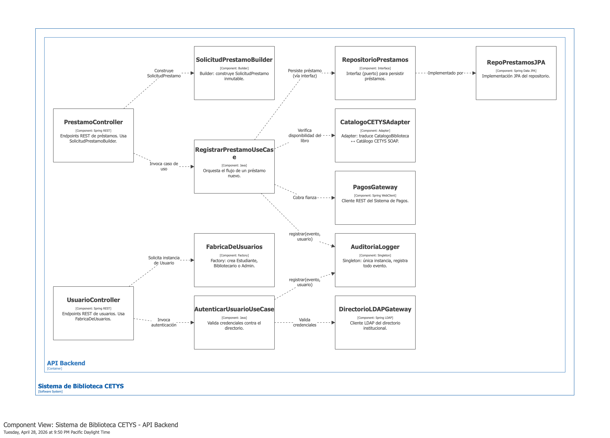

# Pregunta 1C — Diagrama de Componentes (8 pts)

## Enunciado

Selecciona el contenedor API Backend y dibuja su **diagrama de componentes (nivel 3)**. Identifica al menos 5 componentes internos y muestra cómo interactúan entre sí y con los sistemas externos. Incluye al menos un componente que aplique cada patrón cubierto en la sección 2.

## Solución

### Cómo renderizar el diagrama

En el mismo [`workspace.dsl`](./workspace.dsl), selecciona la vista **"Componentes_API"** en [structurizr.com/dsl](https://structurizr.com/dsl) y exporta como PNG a `../diagramas/png/1C-componentes.png`.

### Diagrama

### Componentes propuestos (12 componentes en 4 grupos)

#### 1. Capa de entrada (Controllers)

| Componente | Responsabilidad |
|---|---|
| `PrestamoController` | Endpoints REST de préstamos. Usa `SolicitudPrestamoBuilder` (Builder). |
| `UsuarioController` | Endpoints REST de usuarios. Usa `FabricaDeUsuarios` (Factory). |

#### 2. Capa de Use Cases (aplicación)

| Componente | Responsabilidad |
|---|---|
| `RegistrarPrestamoUseCase` | Orquesta el flujo completo de un préstamo nuevo. |
| `AutenticarUsuarioUseCase` | Valida credenciales contra el directorio LDAP. |

#### 3. Patrones de diseño (Sección 2)

| Componente | Patrón aplicado |
|---|---|
| `AuditoriaLogger` | **Singleton** — única instancia, registra todo evento. |
| `FabricaDeUsuarios` | **Factory** — crea Estudiante, Bibliotecario, Admin sin exponer clases concretas. |
| `CatalogoCETYSAdapter` | **Adapter** — traduce `CatalogoBiblioteca` ↔ Catálogo CETYS SOAP. |
| `SolicitudPrestamoBuilder` | **Builder** — construye `SolicitudPrestamo` inmutable y validada. |

#### 4. Puertos y Gateways

| Componente | Responsabilidad |
|---|---|
| `RepositorioPrestamos` (interfaz) | Puerto del dominio para persistencia de préstamos. |
| `RepoPrestamosJPA` | Implementación JPA del repositorio (capa infraestructura). |
| `PagosGateway` | Cliente REST del Sistema de Pagos. |
| `DirectorioLDAPGateway` | Cliente LDAP del directorio institucional. |

### Mapa patrón → componente

Esta tabla cumple explícitamente con el requisito de incluir al menos un componente que aplique cada patrón de la Sección 2:

| Patrón (Sección 2) | Componente del nivel 3 |
|---|---|
| Singleton | `AuditoriaLogger` |
| Factory | `FabricaDeUsuarios` |
| Adapter | `CatalogoCETYSAdapter` |
| Builder | `SolicitudPrestamoBuilder` |

### Cómo se lee el diagrama

> El **API Backend** se organiza en cuatro grupos de componentes siguiendo Clean Architecture:
>
> 1. **Controllers** son la capa de entrada HTTP. `PrestamoController` recibe una solicitud, la arma con `SolicitudPrestamoBuilder` (Builder) y delega en el caso de uso. `UsuarioController` pide instancias a `FabricaDeUsuarios` (Factory) sin conocer las clases concretas.
>
> 2. **Use Cases** contienen la lógica de aplicación. `RegistrarPrestamoUseCase` coordina el flujo completo: verifica disponibilidad vía `CatalogoCETYSAdapter` (Adapter), persiste vía `RepositorioPrestamos` (interfaz/puerto), cobra la fianza vía `PagosGateway` y registra todo en `AuditoriaLogger` (Singleton).
>
> 3. **Patrones de diseño** materializan los cuatro patrones de la Sección 2.
>
> 4. **Puertos y Gateways** aíslan al sistema de detalles externos. Los use cases nunca llaman directamente a SOAP, REST o LDAP; siempre pasan por un adaptador o gateway. Esto garantiza la **Dependency Rule** de Clean Architecture y prepara el terreno para la Sección 3.
