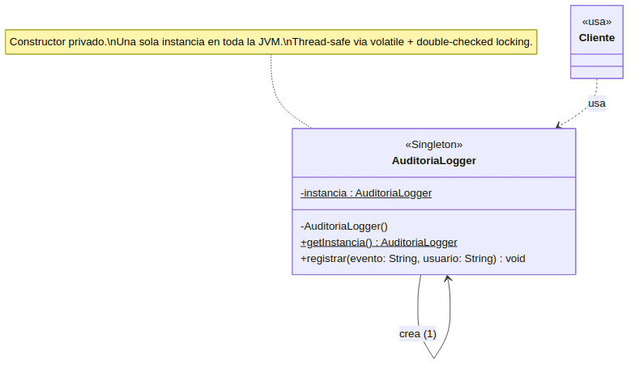
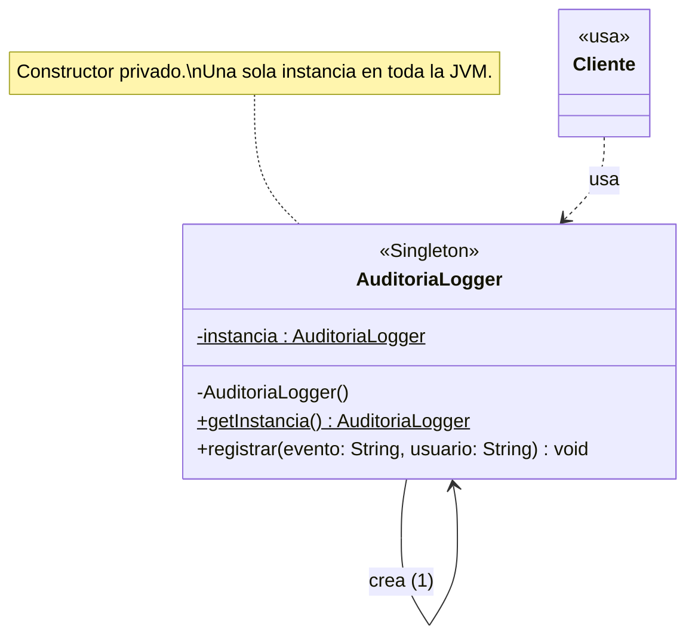

# Pregunta 2A — Singleton · Registro de auditoría (10 pts)

## Enunciado

El rector exige que exista un **único registro de auditoría** en todo el sistema. Implementa la clase `AuditoriaLogger` usando el patrón Singleton. Tu solución debe:

1. Hacer imposible crear más de una instancia. Explica qué tuviste que hacer con el constructor y por qué.
2. Exponer el método `registrar(evento: String, usuario: String)`.
3. Incluir el diagrama de clases UML resultante.
4. Reflexión: ¿qué problema concreto de este sistema resuelve tener una sola instancia? ¿Qué pasaría si hubiera dos instancias simultáneas?

## Solución

### Código

- [`AuditoriaLogger.java`](../../src/main/java/cetys/biblioteca/auditoria/AuditoriaLogger.java) — implementación principal (constructor privado + double-checked locking).
- [`AuditoriaLoggerEnum.java`](../../src/main/java/cetys/biblioteca/auditoria/AuditoriaLoggerEnum.java) — alternativa moderna con enum (Effective Java).
- [`DemoSingleton.java`](../../src/main/java/cetys/biblioteca/demos/DemoSingleton.java) — clase ejecutable que demuestra el comportamiento.

### 1. ¿Qué se hizo con el constructor y por qué?

El constructor de `AuditoriaLogger` se declaró **privado** (`private AuditoriaLogger()`). Esto impide que cualquier código externo invoque `new AuditoriaLogger()`, pues el operador `new` solo es válido dentro de la propia clase. Como consecuencia, el único camino para obtener una instancia es a través del método estático `getInstancia()`, que controla la creación y devuelve siempre la misma referencia almacenada en la variable estática `instancia`.

Adicionalmente, dentro del constructor se valida que `instancia` siga siendo `null`; si alguien intentara romper el patrón mediante reflexión (cambiando el modificador del constructor con `setAccessible(true)`), la segunda llamada lanzaría `IllegalStateException`. La clase también se marcó `final` para evitar que una subclase exponga un constructor público.

Para garantizar **thread-safety** se usó **double-checked locking** con un campo `volatile`:

- `volatile` garantiza que cualquier hilo vea el último valor escrito (visibilidad).
- El `synchronized` interno evita que dos hilos creen la instancia simultáneamente.
- La doble verificación (`if (instancia == null)` antes y dentro del `synchronized`) evita el costo de sincronizar en cada llamada después de que la instancia ya existe.

### 2. Método `registrar`

```java
public synchronized void registrar(String evento, String usuario) {
    String marca = LocalDateTime.now()
        .format(DateTimeFormatter.ISO_LOCAL_DATE_TIME);
    System.out.printf("  [AUDITORIA %s] usuario=%s evento=%s%n", marca, usuario, evento);
}
```

El `synchronized` evita que dos hilos escriban entrelazadamente, lo que produciría líneas mezcladas en el log o eventos perdidos.

### 3. Diagrama UML

Ver [`diagramas/mermaid/2A-singleton.mmd`](../../diagramas/mermaid/2A-singleton.mmd).





### 4. Reflexión

**¿Qué problema concreto resuelve tener una sola instancia?**

El enunciado exige un **único registro de auditoría centralizado**. Si cualquier parte del sistema (controllers, use cases, worker de notificaciones) pudiera instanciar su propio `AuditoriaLogger`, terminaríamos con múltiples loggers escribiendo a destinos potencialmente distintos, con su propio buffer y posiblemente con su propia conexión a la BD de auditoría. El Singleton garantiza que toda la aplicación comparte la misma instancia, lo que se traduce en un solo punto de configuración (formato, destino, nivel de log) y un solo recurso pesado abierto (la conexión a la BD append-only).

**¿Qué pasaría con dos instancias simultáneas?**

Tres problemas concretos:

1. **Pérdida de orden cronológico:** cada instancia mantendría su propio buffer interno; al hacer flush a la BD podrían intercalarse eventos en orden incorrecto, rompiendo la trazabilidad necesaria para una auditoría legalmente válida.

2. **Inconsistencia de configuración:** si un módulo cambia el destino del log en su instancia (ej. para pruebas), la otra instancia seguiría escribiendo al destino original; algunos eventos terminarían "perdidos" o duplicados.

3. **Doble consumo de recursos:** dos conexiones a la BD de auditoría, dos hilos de escritura, dos buffers en memoria. En un sistema con miles de eventos por minuto esto desperdicia recursos y dificulta detectar fugas.

**Trade-off conocido:** el Singleton introduce estado global, lo que dificulta los tests unitarios (no se puede "resetear" entre tests) y acopla el código que lo usa. En la versión final del sistema, los use cases reciben el logger como dependencia inyectada (vía interfaz) en lugar de llamar directamente a `AuditoriaLogger.getInstancia()`. El Singleton sigue garantizando una sola instancia, pero el código de aplicación queda testeable.

### Cómo ejecutar el demo

```bash
mvn compile
mvn exec:java -Dexec.mainClass="cetys.biblioteca.demos.DemoSingleton"
```

O desde IntelliJ: click derecho sobre `DemoSingleton.java` → Run.
