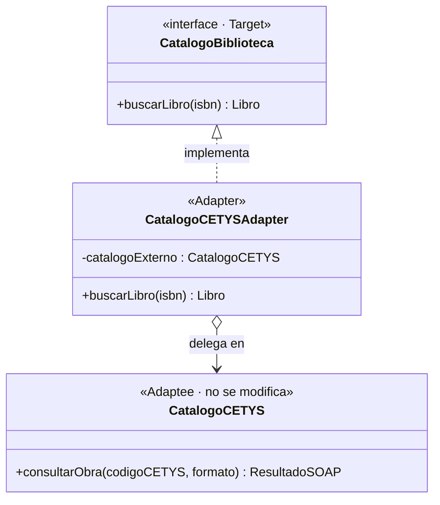

# Pregunta 2C — Adapter · Integración con el Catálogo CETYS *(10 pts)*

## Enunciado

> El sistema interno espera una interfaz CatalogoBiblioteca con el método:
>
> ```java
> buscarLibro(isbn: String): Libro
> ```
>
> El Catálogo CETYS expone el método:
>
> ```java
> consultarObra(codigoCETYS: String, formato: String): ResultadoSOAP
> ```
>
> Con base en lo anterior:
>
> 1. Crea el adaptador que permita al sistema interno usar el catálogo CETYS sin modificar ninguna de las dos clases.
> 2. Dibuja el diagrama UML con las tres clases involucradas y sus relaciones.
> 3. Reflexión: si mañana CETYS cambia de proveedor de catálogo a uno con una interfaz completamente diferente, ¿cuánto código habría que modificar? ¿Por qué?

## Solución

### Código

| Archivo | Rol |
|---------|-----|
| [`Libro.java`](../../src/main/java/cetys/biblioteca/catalogo/Libro.java) | Modelo del dominio interno |
| [`CatalogoBiblioteca.java`](../../src/main/java/cetys/biblioteca/catalogo/CatalogoBiblioteca.java) | Interfaz Target (lo que el sistema espera) |
| [`ResultadoSOAP.java`](../../src/main/java/cetys/biblioteca/catalogo/adaptadores/ResultadoSOAP.java) | DTO externo (NO se modifica) |
| [`CatalogoCETYS.java`](../../src/main/java/cetys/biblioteca/catalogo/adaptadores/CatalogoCETYS.java) | Adaptee (NO se modifica) |
| [`CatalogoCETYSAdapter.java`](../../src/main/java/cetys/biblioteca/catalogo/adaptadores/CatalogoCETYSAdapter.java) | El Adapter |
| [`DemoAdapter.java`](../../src/main/java/cetys/biblioteca/demos/DemoAdapter.java) | Demo ejecutable |

### 1. El Adapter

```java
public class CatalogoCETYSAdapter implements CatalogoBiblioteca {

    private final CatalogoCETYS catalogoExterno;

    public CatalogoCETYSAdapter(CatalogoCETYS catalogoExterno) {
        this.catalogoExterno = catalogoExterno;
    }

    @Override
    public Libro buscarLibro(String isbn) {
        // 1. Traducir el parámetro: ISBN -> codigoCETYS
        String codigoCETYS = mapearIsbnACodigoCETYS(isbn);

        // 2. Llamar al servicio externo con SU firma
        ResultadoSOAP resultado = catalogoExterno.consultarObra(codigoCETYS, "JSON");

        // 3. Traducir la respuesta al modelo interno
        return new Libro(
            isbn,
            resultado.getTituloObra(),
            resultado.getAutorPrincipal(),
            extraerAnio(resultado.getFechaPublicacion()),
            "DISPONIBLE".equalsIgnoreCase(resultado.getEstatus())
        );
    }
}
```

**Variante usada:** Object Adapter (composición, no herencia). El adapter "tiene un" `CatalogoCETYS` y delega en él.

**¿Por qué Object Adapter y no Class Adapter?** Java no soporta herencia múltiple de implementación. Además, la composición permite intercambiar el Adaptee en tiempo de ejecución (útil para mocks en tests).

### 2. Diagrama UML

Ver [`uml-adapter.mmd`](./uml-adapter.mmd) y la versión renderizada en [`uml-adapter.png`](./uml-adapter.png).



### 3. Reflexión: cambio de proveedor

**Pregunta:** *Si mañana CETYS cambia de proveedor de catálogo a uno con una interfaz completamente diferente, ¿cuánto código habría que modificar? ¿Por qué?*

**Respuesta:**

Solo se requiere **agregar una nueva clase adaptadora** y cambiar **una sola línea** en el código de configuración:

| Archivo | ¿Se modifica? | ¿Por qué? |
|---|---|---|
| `CatalogoBiblioteca` (interfaz) | **No** | El contrato interno no cambió. |
| `Libro` (modelo del dominio) | **No** | El sistema sigue trabajando con su propio modelo. |
| `RegistrarPrestamoUseCase` y demás use cases | **No** | Dependen de la abstracción `CatalogoBiblioteca`, no de proveedores concretos. |
| `CatalogoCETYSAdapter` | **No** | Sigue existiendo por si se necesita rollback. |
| `CatalogoNuevoProveedorAdapter` | **Se crea** | Nueva clase con la lógica de traducción al nuevo proveedor. |
| Configuración (`@Bean` de Spring) | **1 línea** | Cambiar `new CatalogoCETYSAdapter(...)` por `new CatalogoNuevoProveedorAdapter(...)`. |

**¿Por qué tan poco impacto?**

Porque el patrón Adapter aplica el principio de **Dependency Inversion**: las capas internas dependen de una abstracción (`CatalogoBiblioteca`), no de implementaciones concretas. La capa concreta (proveedor SOAP, REST, GraphQL, lo que sea) se enchufa por el "borde" del sistema.

**Comparación con un sistema sin Adapter:** si los use cases llamaran directamente a `catalogoCETYS.consultarObra(codigo, formato)`, cambiar de proveedor implicaría un *find-and-replace* por todo el código base, recompilar pruebas, y muy probablemente cambiar el modelo del dominio porque cada proveedor tiene su propio formato de respuesta. Estaríamos hablando de modificar decenas o cientos de archivos.

## Cómo ejecutar la demo

```bash
mvn compile
java -cp target/classes cetys.biblioteca.demos.DemoAdapter
```

**Salida esperada:**

```
=== Demo Adapter: CatalogoCETYSAdapter ===

Libro encontrado:
  ISBN: 978-0134494166
  Título: Clean Architecture
  Autor: Robert C. Martin
  Año: 2017
  Disponible: ✓ sí
```
