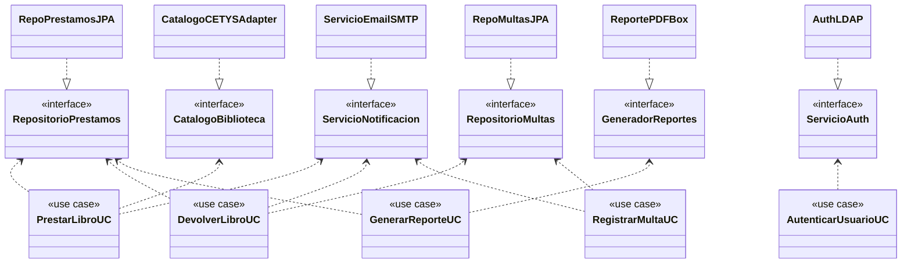

# Pregunta 3A — Análisis de violaciones SOLID (8 pts)

## Enunciado

Se te entrega el siguiente diseño problemático. La clase `GestorBiblioteca` contiene los métodos:

```java
prestarLibro()
devolverLibro()
registrarMulta()
enviarEmailNotificacion()
generarReportePDF()
autenticarUsuario()
consultarCatalogoCETYS()
```

Con base en lo anterior:

1. Identifica qué principios SOLID viola esta clase y explica **por qué** en cada caso.
2. Propón una refactorización: divide la clase en las entidades correctas. Dibuja el diagrama de clases resultante.
3. ¿Cómo se relaciona esta refactorización con la **Dependency Rule** de Clean Architecture?

> El código original ilustrativo está en [`codigo-problema-original/GestorBiblioteca.java`](./codigo-problema-original/GestorBiblioteca.java).
>
> El código refactorizado vive en `src/main/java/cetys/biblioteca/` (paquetes `dominio/`, `aplicacion/`, `infraestructura/`).

## Solución

### 1. Violaciones identificadas

#### Violación principal: SRP (Single Responsibility Principle)

> *"Una clase debe tener una y solo una razón para cambiar."* — Robert C. Martin

`GestorBiblioteca` tiene **al menos cinco razones distintas** para cambiar:

| Si cambia... | La clase debe modificarse | Razón conceptual |
|---|---|---|
| Reglas de préstamo (días, multas) | `prestarLibro`, `devolverLibro`, `registrarMulta` | Política de negocio |
| Proveedor de email (SMTP → SendGrid) | `enviarEmailNotificacion` | Infraestructura de mensajería |
| Librería de PDF (iText → PDFBox) | `generarReportePDF` | Infraestructura de reportes |
| Esquema del directorio LDAP | `autenticarUsuario` | Seguridad/Identidad |
| API SOAP del catálogo CETYS | `consultarCatalogoCETYS` | Integración externa |

Cualquiera de esos cinco cambios fuerza a tocar la clase, recompilarla, y re-probar todos sus métodos aunque no estén relacionados.

#### Violación: OCP (Open/Closed Principle)

> *"Abierto a extensión, cerrado a modificación."*

Si mañana se agrega un nuevo canal de notificación (SMS, push), hay que **modificar** `enviarEmailNotificacion` o agregar `enviarSMSNotificacion` directamente en `GestorBiblioteca`. La clase no está cerrada a modificación; cada nueva funcionalidad la engorda.

#### Violación: DIP (Dependency Inversion Principle)

> *"Los módulos de alto nivel no deben depender de módulos de bajo nivel; ambos deben depender de abstracciones."*

`GestorBiblioteca` (alto nivel: lógica de negocio) depende directamente de detalles de infraestructura (bajo nivel): cliente SMTP, librería de PDF, cliente SOAP, cliente LDAP. La lógica de "prestar un libro" queda atada a *cómo* se envía un email, *cómo* se genera un PDF y *cómo* se habla con CETYS. Sin abstracciones intermedias, no se puede reemplazar la implementación sin tocar la lógica.

#### Violación: ISP (Interface Segregation Principle)

> *"Los clientes no deben depender de métodos que no usan."*

Si un componente solo necesita generar reportes (por ejemplo, un job mensual), al recibir un `GestorBiblioteca` queda expuesto a `prestarLibro`, `autenticarUsuario` y todo lo demás. Cualquier cliente "hereda" toda la superficie pública aunque solo use el 10%.

### 2. Refactorización propuesta

La estrategia es: **separar por responsabilidad**, **invertir las dependencias** hacia interfaces, y **alinear con Clean Architecture** (capas: dominio → use cases → adaptadores → infraestructura).

#### Resultado

| Original | Refactorizado |
|---|---|
| 1 clase con 7 métodos heterogéneos | 5 use cases independientes + 6 puertos + 5 adaptadores |
| Acoplamiento directo a SMTP/PDF/SOAP/LDAP/JPA | Use cases dependen solo de interfaces (puertos del dominio) |
| Cambio de proveedor → recompilar todo | Cambio de proveedor → crear adaptador nuevo, no tocar use cases |

#### Estructura de paquetes resultante

```
cetys.biblioteca/
├── dominio/
│   ├── modelo/
│   │   └── Prestamo.java
│   └── puertos/                       ← interfaces del dominio
│       ├── RepositorioPrestamos.java
│       ├── ServicioNotificacion.java
│       └── PagosGateway.java
├── aplicacion/
│   └── RegistrarPrestamoUseCase.java  ← use case (3B)
├── catalogo/                          ← Adapter (2C)
│   ├── CatalogoBiblioteca.java
│   └── adaptadores/
│       ├── CatalogoCETYS.java
│       ├── CatalogoCETYSAdapter.java
│       └── ResultadoSOAP.java
├── infraestructura/
│   ├── persistencia/
│   │   └── RepoPrestamosEnMemoria.java
│   ├── notificacion/
│   │   └── ServicioNotificacionConsola.java
│   └── pagos/
│       └── PagosGatewaySimulado.java
└── auditoria/
    └── AuditoriaLogger.java           ← Singleton (2A)
```

### Diagrama de clases resultante

Ver [`diagramas/mermaid/3A-refactor-solid.mmd`](../../diagramas/mermaid/3A-refactor-solid.mmd).




> `direction BT` (bottom-to-top) hace que las flechas suban hacia el dominio, reforzando visualmente la **Dependency Rule**.

### 3. Relación con la Dependency Rule de Clean Architecture

La **Dependency Rule** de Clean Architecture establece que *las dependencias del código fuente solo pueden apuntar hacia adentro*: las capas externas (frameworks, BD, UI, integraciones) pueden depender de las internas (use cases, dominio), pero **nunca al revés**. El dominio no debe saber que existen JPA, SMTP, PDFBox, LDAP o SOAP.

En el diseño original de `GestorBiblioteca`, la regla se viola flagrantemente: la lógica de negocio (alto nivel) llama directamente a clientes de email, librerías de PDF y stubs SOAP (bajo nivel). Las flechas de dependencia apuntan **hacia afuera**. El resultado es que cualquier cambio en infraestructura obliga a recompilar el dominio.

En la refactorización, las flechas se **invierten**:

1. **Los use cases ya no dependen de implementaciones**, sino de **interfaces (puertos)** que ellos mismos definen y poseen. `PrestarLibroUseCase` declara que necesita "algo" que sepa notificar (`ServicioNotificacion`), pero no le importa si por debajo es SMTP, SendGrid o un mock de pruebas.

2. **Las implementaciones concretas viven en la capa externa** (infraestructura) y **dependen** del dominio porque implementan sus interfaces. `ServicioEmailSMTP implements ServicioNotificacion`: la clase de infraestructura *apunta hacia adentro*. Esta es la **inversión de dependencia** del DIP, que es el mecanismo técnico que hace cumplir la Dependency Rule.

3. **El dominio queda en el centro y no sabe nada del exterior.** Si mañana se elimina el envío de email y se reemplaza por notificaciones push, push WebSocket o cola Kafka, los use cases no se modifican. Solo cambia qué adaptador se inyecta en el ensamblaje (la clase de configuración Spring).

En el diagrama, todas las flechas apuntan hacia el centro (puertos del dominio): los use cases dependen de puertos (apuntan al dominio) y los adaptadores implementan puertos (también apuntan al dominio). Visualmente y estructuralmente, la regla se cumple.
