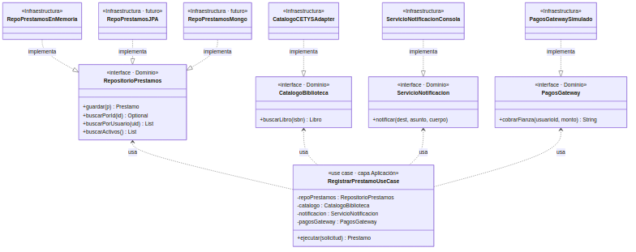
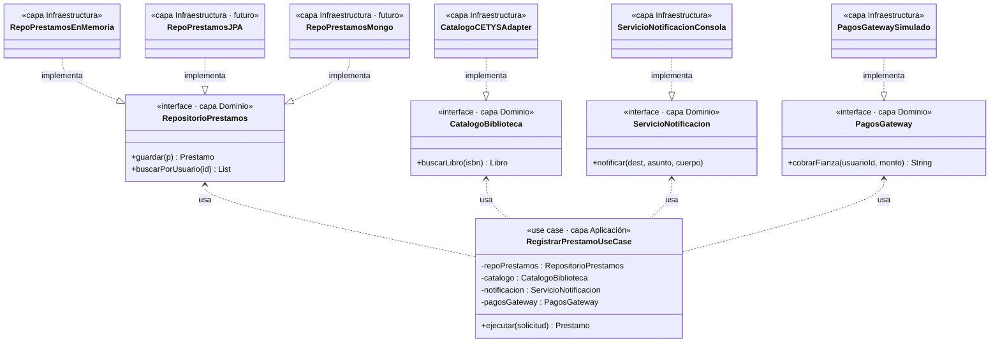

# Pregunta 3B — Diseño de la capa de Use Cases (12 pts)

## Enunciado

Siguiendo Clean Architecture, el caso de uso *"Registrar préstamo"* debe ser **independiente** de la base de datos y del framework web.

1. Define la interfaz del repositorio `RepositorioPrestamos` y ubícala en la capa arquitectónica correcta. Justifica la ubicación.
2. Implementa la clase `RegistrarPrestamoUseCase` que use esa interfaz (no la implementación concreta).
3. Explica cómo la **Dependency Rule** garantiza que cambiar de MySQL a MongoDB no requiera tocar el use case.
4. ¿Qué patrón de los estudiados en clase aparece **implícitamente** en este diseño?

## Solución

### Código

| Archivo | Capa | Rol |
|---|---|---|
| [`Prestamo.java`](../src/main/java/cetys/biblioteca/dominio/modelo/Prestamo.java) | Dominio | Modelo del dominio |
| [`RepositorioPrestamos.java`](../src/main/java/cetys/biblioteca/dominio/puertos/RepositorioPrestamos.java) | Dominio | Puerto (interfaz) |
| [`ServicioNotificacion.java`](../src/main/java/cetys/biblioteca/dominio/puertos/ServicioNotificacion.java) | Dominio | Puerto (interfaz) |
| [`PagosGateway.java`](../src/main/java/cetys/biblioteca/dominio/puertos/PagosGateway.java) | Dominio | Puerto (interfaz) |
| [`RegistrarPrestamoUseCase.java`](../src/main/java/cetys/biblioteca/aplicacion/RegistrarPrestamoUseCase.java) | Aplicación | Use case |
| [`RepoPrestamosEnMemoria.java`](../src/main/java/cetys/biblioteca/infraestructura/persistencia/RepoPrestamosEnMemoria.java) | Infraestructura | Adaptador de persistencia |
| [`ServicioNotificacionConsola.java`](../src/main/java/cetys/biblioteca/infraestructura/notificacion/ServicioNotificacionConsola.java) | Infraestructura | Adaptador de notificación |
| [`PagosGatewaySimulado.java`](../src/main/java/cetys/biblioteca/infraestructura/pagos/PagosGatewaySimulado.java) | Infraestructura | Adaptador de pagos |

### 1. Interfaz `RepositorioPrestamos` y su ubicación

#### La interfaz

```java
package cetys.biblioteca.dominio.puertos;

public interface RepositorioPrestamos {
    Prestamo guardar(Prestamo prestamo);
    Optional<Prestamo> buscarPorId(String id);
    List<Prestamo> buscarPorUsuario(String usuarioId);
    List<Prestamo> buscarActivos();
}
```

#### Ubicación: capa de **dominio** (paquete `dominio.puertos`)

**Justificación:**

La interfaz `RepositorioPrestamos` se ubica en la **capa de dominio** y no en la capa de infraestructura, aunque parezca contraintuitivo (una interfaz "de base de datos" en el dominio). Esta es precisamente la idea central de la **Dependency Inversion**.

Tres razones concretas:

1. **El dominio es el "dueño" del contrato.** Es el dominio quien necesita persistir préstamos, así que es el dominio quien define *qué operaciones* necesita: guardar, buscar, listar activos. La capa de infraestructura es una *cumplidora* del contrato, no su autora.

2. **Si la interfaz viviera en infraestructura**, el dominio dependería de infraestructura para usarla, lo que invertiría la Dependency Rule. La flecha apuntaría hacia afuera. Al colocarla en el dominio, los adaptadores (JPA, MongoDB, en memoria) son los que apuntan hacia adentro al implementarla.

3. **El vocabulario es del dominio.** La interfaz habla de `Prestamo`, no de filas, documentos, columnas o `_id`. Si mañana cambia el motor de persistencia, el lenguaje de la interfaz no cambia porque está expresado en términos del negocio, no del almacenamiento.

Este patrón se conoce en la literatura como *"Ports and Adapters"* (Hexagonal Architecture, Alistair Cockburn) y como *"interface ownership inversion"* (Robert C. Martin, *Clean Architecture*, cap. 11).

### 2. `RegistrarPrestamoUseCase`

Ver el código completo en [`RegistrarPrestamoUseCase.java`](../src/main/java/cetys/biblioteca/aplicacion/RegistrarPrestamoUseCase.java).

Lo más importante son las dependencias del constructor: **TODAS son interfaces del dominio**:

```java
public RegistrarPrestamoUseCase(RepositorioPrestamos repoPrestamos,
                                CatalogoBiblioteca catalogo,
                                ServicioNotificacion notificacion,
                                PagosGateway pagosGateway) {
    // ...
}
```

NO depende de:
- JPA, MongoDB ni ningún motor de persistencia
- SMTP, SendGrid ni ningún proveedor de email
- Spring REST, Spring Web ni ningún framework HTTP
- SOAP, REST, LDAP ni ningún protocolo concreto

### Diagrama de la capa de Use Cases

Ver [`diagramas/mermaid/3B-use-cases.mmd`](../diagramas/mermaid/3B-use-cases.mmd).





### 3. Cambio MySQL → MongoDB sin tocar el use case

La **Dependency Rule** establece que el código fuente solo puede tener dependencias que apunten *hacia adentro*. En este diseño, la dirección de las dependencias es:

```
RegistrarPrestamoUseCase  ───→  RepositorioPrestamos  ←───  RepoPrestamosJPA
     (aplicación)                  (dominio)                (infraestructura)
```

El use case apunta hacia adentro: depende de `RepositorioPrestamos`, una **abstracción** del dominio. La implementación concreta `RepoPrestamosJPA` también apunta hacia adentro: implementa la misma interfaz del dominio. **Ninguna flecha sale del dominio hacia afuera.**

#### Tabla de impacto al cambiar MySQL → MongoDB

| Archivo | ¿Se modifica? | Por qué |
|---|---|---|
| `RegistrarPrestamoUseCase` | **No** | Sigue dependiendo de `RepositorioPrestamos`. No sabe ni le importa cómo se persiste. |
| `Prestamo` (entidad de dominio) | **No** | El modelo del dominio es independiente del almacenamiento. |
| `RepositorioPrestamos` (interfaz) | **No** | El contrato no cambia. |
| `RepoPrestamosJPA` | **No (queda como respaldo)** | Sigue siendo válido para el rollback a MySQL. |
| `RepoPrestamosMongo` (nueva clase) | **Se crea** | Implementación nueva del mismo contrato, usando MongoDB driver. |
| Configuración (Spring `@Configuration`) | **1 línea** | Cambiar qué `@Bean` se inyecta como `RepositorioPrestamos`. |

#### Por qué es posible

Porque el use case nunca conoció la palabra "MySQL" ni "JPA". Su única dependencia es la interfaz `RepositorioPrestamos`, que está expresada en términos del dominio (`guardar(Prestamo)`, `buscarPorUsuario(id)`), no en términos de SQL ni de colecciones MongoDB. El motor de persistencia es un **detalle** que vive en la frontera externa del sistema, y los detalles externos pueden cambiar sin afectar al núcleo.

#### El test definitivo

Si los tests del use case se siguen ejecutando con un mock de `RepositorioPrestamos` (sin MySQL ni MongoDB instalado), entonces el use case está correctamente desacoplado:

```java
@Test
void registra_prestamo_correctamente() {
    RepositorioPrestamos mockRepo = mock(RepositorioPrestamos.class);
    CatalogoBiblioteca mockCat   = mock(CatalogoBiblioteca.class);
    ServicioNotificacion mockNot = mock(ServicioNotificacion.class);
    PagosGateway mockPagos       = mock(PagosGateway.class);

    RegistrarPrestamoUseCase uc =
        new RegistrarPrestamoUseCase(mockRepo, mockCat, mockNot, mockPagos);
    // Configurar mocks y ejecutar...
}
```

Este test no toca disco, no necesita MySQL ni MongoDB. Eso prueba que el use case está realmente desacoplado, no solo en teoría.

### 4. Patrón implícito: Adapter

**El patrón implícito es Adapter** (de la Pregunta 2C), aplicado ahora a la persistencia en lugar de al catálogo:

| Rol del patrón Adapter | En 2C (catálogo) | En 3B (persistencia) |
|---|---|---|
| **Target** (interfaz interna esperada) | `CatalogoBiblioteca` | `RepositorioPrestamos` |
| **Adapter** (clase que traduce) | `CatalogoCETYSAdapter` | `RepoPrestamosJPA` / `RepoPrestamosEnMemoria` |
| **Adaptee** (sistema externo / detalle técnico) | `CatalogoCETYS` (cliente SOAP) | `EntityManager` / Spring Data JPA / colecciones de Java |

En ambos casos, una interfaz expresada en términos del dominio se "enchufa" a una tecnología concreta cuya API es distinta. `RepoPrestamosJPA` es un **adaptador entre el lenguaje del dominio (`Prestamo`) y el lenguaje de la BD (entidades JPA, filas SQL)**. Si mañana hay un `RepoPrestamosMongo`, será otro adaptador que traduce entre `Prestamo` y documentos BSON.

**Patrones secundarios que también aparecen:**

- **Repository pattern** (Eric Evans, *Domain-Driven Design*): la interfaz `RepositorioPrestamos` es literalmente un repositorio en el sentido DDD: una colección abstracta que oculta el almacenamiento.
- **Dependency Injection**: el use case recibe sus dependencias por constructor en lugar de instanciarlas. Esto es lo que hace posible inyectar mocks en tests y cambiar implementaciones sin modificar el use case.

Pero la respuesta directa al "patrón de los estudiados en clase" es **Adapter**.

### Cómo ejecutar el demo

```bash
mvn exec:java -Dexec.mainClass="cetys.biblioteca.demos.DemoFlujoCompleto"
```

Este demo ejecuta el use case completo con adaptadores en memoria/simulados, demostrando que el use case es independiente de la implementación concreta.
