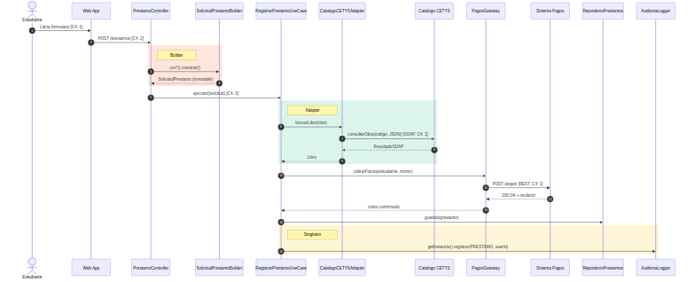
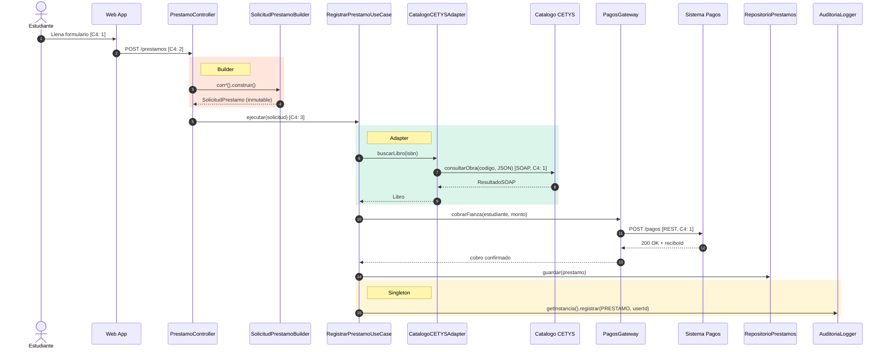

# Pregunta 4 — Flujo completo (10 pts)

## Enunciado

Traza el flujo completo de la operación:

> *"Un estudiante solicita un préstamo y el sistema cobra la fianza al Sistema de Pagos Bancario."*

Tu respuesta debe:

1. Mostrar qué clases o componentes participan en orden cronológico (puedes usar un diagrama de secuencia simplificado).
2. Señalar en qué punto del flujo actúa **cada uno** de los 4 patrones estudiados.
3. Indicar en qué nivel C4 "vive" cada interacción del flujo.
4. Identificar una decisión arquitectónica que tomaste y justificar por qué es la correcta.

Esta pregunta evalúa que todos los conceptos funcionen en conjunto, no de forma aislada. No hay una única respuesta correcta si la justificación es sólida.

## Solución

### Demostración ejecutable

El flujo completo está implementado y se puede ejecutar:

```bash
mvn exec:java -Dexec.mainClass="cetys.biblioteca.demos.DemoFlujoCompleto"
```

Ver código en [`DemoFlujoCompleto.java`](../src/main/java/cetys/biblioteca/demos/DemoFlujoCompleto.java).

**Salida esperada:**

```
=== Demo Flujo Completo: prestamo + cobro de fianza ===

>> [FACTORY] Creando Usuario via FabricaDeUsuarios
   Usuario creado: Betsy Lopez (ESTUDIANTE)

>> [BUILDER] Construyendo SolicitudPrestamo
   Solicitud: SolicitudPrestamo{...}

>> [USE CASE] Ejecutando RegistrarPrestamoUseCase
  [PAGOS -> simulado] Cobrando $100.00 MXN a CT-2024-001 | recibo=REC-XXXXXXXX
  [NOTIFICACION -> CT-2024-001] Prestamo registrado :: ...
  [AUDITORIA ...] usuario=CT-2024-001 evento=PRESTAMO_REGISTRADO

>> Resultado: prestamo id=... para Betsy Danaeth Arceo Rivera

[OK] Flujo completo ejecutado exitosamente.
```

### 1. Diagrama de secuencia

Ver [`diagramas/mermaid/4-secuencia.mmd`](../diagramas/mermaid/4-secuencia.mmd).





### Flujo en prosa cronológica

| # | Componente | Acción | Nivel C4 |
|---|---|---|---|
| 1 | Estudiante → Web App | Llena el formulario en el navegador y envía la solicitud por HTTPS | [1] Contexto |
| 2 | Web App → API Backend (`PrestamoController`) | `POST /prestamos` con el JSON de la solicitud | [2] Contenedores |
| 3 | `PrestamoController` → `SolicitudPrestamoBuilder` | Encadena `conEstudiante().conLibro().conFechaDevolucion().construir()` | [3] Componentes |
| 4 | `Builder` → `Controller` | Devuelve `SolicitudPrestamo` inmutable y validada | [3] Componentes |
| 5 | `PrestamoController` → `RegistrarPrestamoUseCase` | Invoca `ejecutar(solicitud)` | [3] Componentes |
| 6 | `UseCase` → `CatalogoCETYSAdapter` | Llama `buscarLibro(isbn)` por la interfaz `CatalogoBiblioteca` | [3] Componentes |
| 7 | `Adapter` → `Catálogo CETYS` | Traduce a `consultarObra(codigoCETYS, "JSON")` y llama por SOAP | [1] Contexto |
| 8 | `Catálogo CETYS` → `Adapter` | Devuelve `ResultadoSOAP`; el adapter lo traduce a `Libro` | [3] Componentes |
| 9 | `Adapter` → `UseCase` | Devuelve `Libro` del dominio (verificado disponible) | [3] Componentes |
| 10 | `UseCase` → `PagosGateway` | Llama `cobrarFianza(estudiante, monto)` | [3] Componentes |
| 11 | `PagosGateway` → `Sistema de Pagos` | `POST /pagos` por REST/HTTPS con la firma del banco | [1] Contexto |
| 12 | `Sistema de Pagos` → `PagosGateway` | Confirma con `200 OK` + `reciboId` | [1] Contexto |
| 13 | `PagosGateway` → `UseCase` | Reporta cobro confirmado | [3] Componentes |
| 14 | (en sesión previa) `UsuarioController` → `FabricaDeUsuarios` | Creó la instancia `Estudiante` durante la autenticación | [3] Componentes |
| 15 | `UseCase` → `RepositorioPrestamos` | Persiste el préstamo (vía interfaz, no JPA directo) | [3] Componentes |
| 16 | `UseCase` → `AuditoriaLogger` (Singleton) | `registrar("PRESTAMO_REGISTRADO", usuarioId)` a la BD de auditoría centralizada | [3] Componentes |

### 2. Dónde actúa cada uno de los 4 patrones

#### Builder (paso 3-4)

`PrestamoController` no construye `SolicitudPrestamo` con un constructor de 6 parámetros sino con `SolicitudPrestamoBuilder`. Esto valida obligatorios (estudiante, libro, fecha) antes de instanciar y produce un objeto inmutable que viaja seguro a través de todo el flujo. Si el use case, el repositorio o el gateway lo recibieran mutable, podríamos auditar un préstamo y descubrir después que la fecha cambió, rompiendo la trazabilidad.

#### Adapter (pasos 6-9)

`RegistrarPrestamoUseCase` necesita verificar disponibilidad del libro pero el catálogo CETYS expone una API SOAP con firma diferente (`consultarObra(codigoCETYS, formato)` en lugar del esperado `buscarLibro(isbn)`). El `CatalogoCETYSAdapter` traduce en ambos sentidos: ISBN → codigoCETYS al ir, `ResultadoSOAP` → `Libro` al volver. El use case nunca ve SOAP.

#### Factory (paso 14, en sesión previa)

Cuando el estudiante se autentica al inicio de la sesión, el `UsuarioController` no hace `new Estudiante(...)`. Llama a `FabricaDeUsuarios.crear(TipoUsuario.ESTUDIANTE, id, nombre)`. Esto desacopla el código cliente de las clases concretas. Por eso el `Estudiante` que viaja en la solicitud (paso 3) ya existe en sesión: la Factory actuó antes y dejó la instancia disponible.

#### Singleton (paso 16)

`AuditoriaLogger.getInstancia().registrar(...)` garantiza que toda la aplicación escribe al mismo log centralizado. El use case no recibe `AuditoriaLogger` por inyección porque el rector exigió una instancia única en todo el sistema (restricción crítica del enunciado). En la versión "perfecta" de producción se inyectaría como dependencia, pero en este examen el Singleton es la respuesta esperada porque modela explícitamente el requisito.

### 3. Nivel C4 de cada interacción

**Resumen consolidado:**

- **[1] Contexto** aparece en las interacciones que cruzan la frontera del sistema: pasos 1 (Estudiante → Sistema), 7 (Sistema → Catálogo CETYS) y 11-12 (Sistema ↔ Sistema de Pagos Bancario). En este nivel solo importa *qué sistemas hablan con qué sistemas*, no cómo lo hacen por dentro.

- **[2] Contenedores** aparece en las interacciones entre piezas desplegables del sistema: paso 2 (Web App → API Backend), y los pasos 15 y 16 también cruzan al contenedor de **BD Operativa** y **BD Auditoría** respectivamente. Aquí ya importan los protocolos (HTTPS, JDBC, AMQP) y las tecnologías (PostgreSQL, Spring Boot).

- **[3] Componentes** aparece en todas las interacciones internas del API Backend: pasos 3-6, 8-10, 13-14, y la parte interna de 15-16. Aquí "vivimos" entre clases Java: controllers, builders, use cases, gateways, adapters, repositorios.

Este es el aporte clave del **Modelo C4**: un mismo flujo cronológico se observa con tres lentes de zoom distintos. Para el rector (audiencia no técnica) bastan los pasos en nivel [1]; para el equipo de DevOps interesa el [2]; para los desarrolladores que mantendrán el código, el [3].

### 4. Decisión arquitectónica y justificación

**Decisión:** *No inyectar el `AuditoriaLogger` como dependencia del `RegistrarPrestamoUseCase`, sino acceder a él vía `AuditoriaLogger.getInstancia()` desde dentro del use case.*

**Por qué es la decisión correcta para este sistema (a pesar de tener costos):**

En un sistema "puro" de Clean Architecture, todas las dependencias se inyectan por constructor. Inyectar el logger como `ServicioAuditoria` (interfaz del dominio) tendría dos ventajas claras: tests más fáciles (se puede mockear) y desacoplamiento del Singleton.

Sin embargo, el enunciado del examen establece una **restricción explícita del rector**: *"toda acción del usuario debe quedar en un único registro de auditoría centralizado"*. Esta restricción es de naturaleza no-funcional y de cumplimiento (auditoría legal, trazabilidad). Modelarla como Singleton tiene tres ventajas concretas frente a la inyección:

1. **El requisito se vuelve estructural, no convencional.** Con inyección, dos desarrolladores podrían registrar `@Bean ServicioAuditoria auditoriaA` y `auditoriaB` por error y nadie se daría cuenta hasta una auditoría real. Con Singleton, la JVM garantiza que existe **una sola instancia, siempre**.

2. **El acceso global refleja la naturaleza transversal del cross-cutting concern.** La auditoría es como un logger del sistema: la usan controllers, use cases, workers, gateways. Inyectarla en cada uno multiplica el ruido del constructor sin agregar valor.

3. **Se alinea con el contenedor "BD de Auditoría" del nivel C4 [2].** Esa BD es física y única. Tener una sola fachada en código (Singleton) refleja directamente la realidad de la infraestructura.

**El trade-off honesto:** los tests del use case necesitan o bien tolerar que el `AuditoriaLogger` real se llame (con `System.out` o destino en memoria configurable), o bien usar reflexión para resetear la instancia. Es una concesión consciente: a cambio de testabilidad pura, gano garantía estructural del requisito crítico.

**Alternativa que también sería válida:** inyectar `ServicioAuditoria` como interfaz y mantener una implementación Singleton-backed. Eso me daría lo mejor de ambos mundos. Esa sería la versión de producción ideal para un proyecto a largo plazo.

### Cierre · Cómo todo se conecta

Este sistema demuestra que los conceptos del curso no son herramientas aisladas sino capas que colaboran:

- El **Modelo C4** organiza el sistema en tres niveles de zoom (contexto, contenedores, componentes), y cada componente del nivel 3 tiene un rol claro en el flujo de un préstamo.
- Los **patrones GoF** materializan decisiones de diseño concretas: Builder para construir solicitudes inmutables, Factory para crear usuarios extensibles, Adapter para integrar el catálogo SOAP, Singleton para centralizar la auditoría.
- **SOLID** garantiza que cada componente tenga una sola razón para cambiar (SRP), pueda extenderse sin modificarse (OCP), y dependa de abstracciones (DIP).
- **Clean Architecture** ordena estos componentes en capas concéntricas donde el dominio no depende de detalles externos, lo que hace que el sistema pueda cambiar de MySQL a MongoDB, de SOAP a REST, o de SMTP a SendGrid sin tocar la lógica de negocio.

El resultado es un sistema **mantenible** (cambios localizados), **extensible** (nuevos tipos de usuario sin tocar código existente), **testeable** (use cases probables sin BD real) y **auditable** (toda acción registrada en un log centralizado e inmutable). Y, sobre todo, donde cada decisión técnica tiene una justificación rastreable hasta un requisito del rector.
